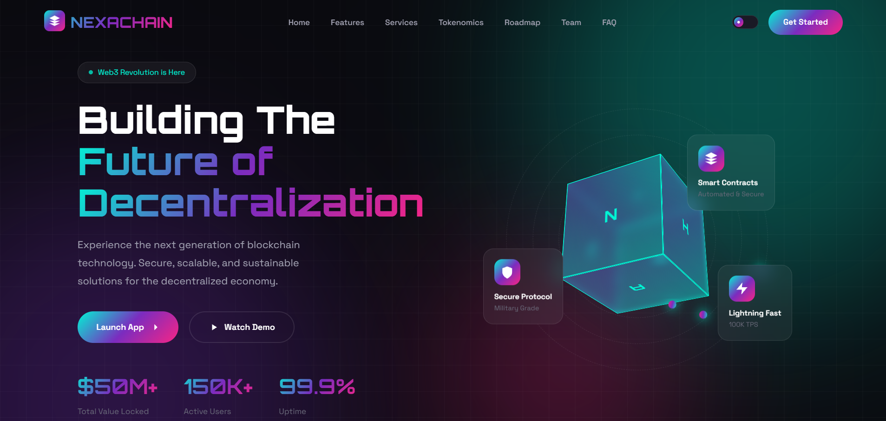

# 🌐 Omkar R. Ghare — AI Crypto Web3 Landing (v3)

A next-generation **AI + Web3 startup landing page** combining blockchain aesthetics with intelligent design elements.

---

## 🚀 Live Demo  
🔗 https://omkarghare8.github.io/web3-blockchain-startup-landing-page-template-v3/

---

## ✨ Features

- AI-inspired gradient design  
- Glassmorphism UI elements  
- Responsive layout  
- Animated hero section  
- Features & roadmap  
- Contact form section  

---

## 🛠 Tech Stack

- HTML5  
- CSS3  
- JavaScript  
- Modern UI effects  

---

## 📸 Preview

---

## 🎯 Purpose of This Project

To experiment with AI-themed Web3 design and improve UI/UX structuring skills.

---

## 👨‍💻 Author

**Omkar R. Ghare**
